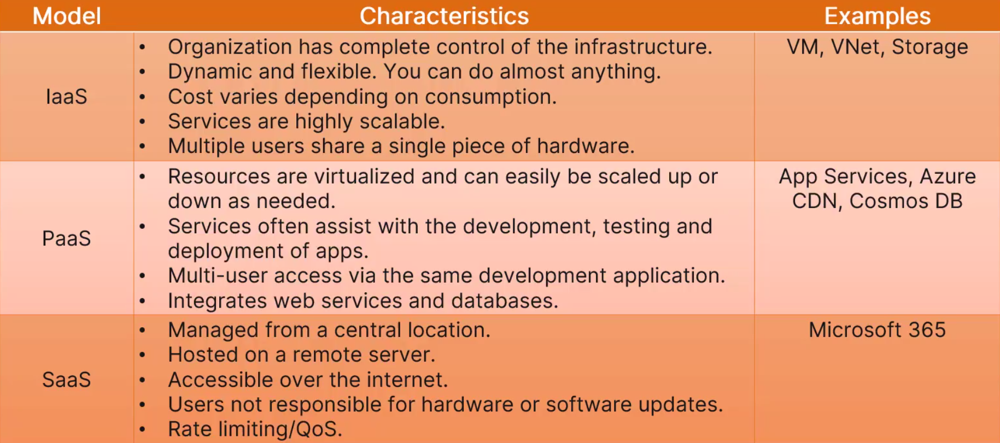
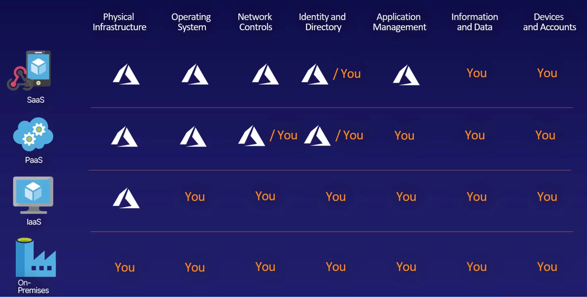

## AZ-900 Microsoft Azure Fundamentals
## Microsoft Certified Azure Fundamentals Exam AZ-900 (Jim Boyce)
### Chapter 1: Cloud Concepts: computer, networking, storage
  - DESCRIBE CLOUD SERVICES
    - Identify the benefits and considerations of using cloud services
      - Identify the benefits of cloud computing, such as High Availability, Scalability, Elasticity, Agility, and Disaster Recovery
        - **Scalability**: the process of adding more resources on an as-needed basis
          - horizontal scaling: add more servers to scale out, then scale in (eliminate the additional servers)
          - vertical scaling: increasing the amount of memory to scaling up, then scling down.
        - Elasticity: automatic scaling
        - Agility: refers to the capability to quickly deploy services with reduced effort and cost. Azure makes it very easy to scale resources to meet demand requirements, and Autoscale—once configured—can make it almost effortless to scale resources. The capability to rapidly adjust resources to meet demand is one aspect of cloud agility.
        - **High Availability (HA)**: service level agreement (SLA): Composite SLA = SLA * SLA * SLA
        - **Reliability**: resilience, depoy in multiple locations, No sigle point of failure
          - Fault Tolerance: generally applies at the component level of a service
          - Disaster Recovery: refers to the process of recovering from a situation where multiple systems or services fail
        - **Predictability**: predictable performance and costs, knowing your application will always perform as expected and knowing what it will cost
        - Management: 
          - **Security**: having full control of your cloud security posture
          - **Governamce**: standardizing cloud deployments to meet requirments/company standards
          - **Manageability**: management of cloud resources and how we interact with them
            - Management of the cloud:
              - Autoscaling
              - Monitoring
              - Template-based deployments
            - Management in the cloud:
              - Portal
              - CLI
              - APIs
        - principles of economies of scale (规模经济): Technical economies of scale are achieved when a cloud provider can purchase a large amount of hardware and other infrastructure at a discount ...
      - Identify the differences between Capital Expenditure (CapEx) and Operational Expenditure (OpEx)
      - Describe the consumption-based model
    - Financial Models: highlights the benefits of moving from a capital expenditure model to an operational expenditure model
    - Cloud Computing Models and Responsibilities: Trade-offs exist within each model between flexibility and control
      - Infrastructure-as-a-Service (IaaS): servers, storage and networking as a service
        - (vitualization, Networks, physical buildings), 
        - IaaS generally has a higher shared responsibility than SaaS
      - Platform-as-a-Service (PaaS): 
        - ((Iaas), Middleware, tools such as database management tools), 
        - supports web application life cycle, avoids software license hell, 
        - provides a development platform that you can use to create and deploy many different types of web applications without worrying about deploying or managing the servers and other infrastructure that support that application
      - Software-as-a-Service (SaaS): Office 365, Azure SQL
        - ((Paas) Apps):
        - no maintenance and latest features
      - Serverless: Extreme PaaS
        - Azure Functions is the best know serverless service
      
      - Shared Responsibility 
        - 
        - 
    - Azure Marketplace: an extra layer of functionality for your cloud applications, by letting users use and integrate third-party products and services. greate place to using or selling a service
      - solutions and services
      - azure app store
      - easy to integrate
      - publish your own
    - Cloud architecture models: Public, Private, and Hybrid Cloud Models: The key to differentiating between a hybrid cloud scenario and a mix of on-premises and cloud services is whether there is service interaction between your on-premises service and the related service(s) in the cloud. If you do have interaction between services, then you do have a hybrid cloud scenario.
      - Public： Reduced cost
      - Private：Greater control over systems, applications, and data
      - Hybrid: non-cloud services hosted on-premises directly interact with services hosted in either a public or a private cloud

### Charpter 2: Azure Core Services
  - Core Azure Architectural Components
    - Geographies and Regions
      - Geographies: Azure geographies generally align to specific countries or aligned to specific markets like Asia.
      - Regions: Within each geography are Azure regions, A region is a grouping of data centers that interact to provide redundancy and availability for the services hosted within that region
        - location
        - features
        - price
      - Paired Region: each region is paired, outage failover, if primary region has an outage you can failover to the secondary region
    - Availability Zones: Physical Location, Independent, each region has a minimum of three zones
      - Zone services:
      - Zone-redundant services:
    - Resources and Resource Groups:
      - Resource Groups: a logical container for one or more resources, Resources in a group can reside in various regions
    - Azure Resource Manager (ARM): is the service that enables you to manage resources, serving as the deployment and management service for Azure, ARM is not a tool or interface. Rather, as a service it functions as the broker between management tools like the Azure portal and resource providers
  - Azure Subscriptions and Billing Scope
    - Azure Subscriptions: billing entity that controls the cost of resources and services associated with it.
    - Azure Billing Accounts:
      - Microsoft Online Services Program
      - Enterprise agreement (EA)
      - Microsoft Customer Agreement (MCA)
    - Billing Scope
    - Azure Tenants: is a dedicated instance of Azure AD. It represents your organization in Azure. a specific instance of Azure Active Directory (AAD) that contains accounts and groups. a tenant is a group of users.
  - Core Azure Services
    - Virtual Machines:
      - pricing: calculated hourly
    - Scale Sets: a group of identical, load balanced VMs, auto scaling, large scale (1000), taking VMs to the next level.
    - Availability Sets
      - update domains: is a logical group of hardware that undergoes maintenance activities or reboot events at the same time
      - fault domains: is a logical grouping of hardware that shares a power source and network switch, similar to a physical rack in a data center
    - Azure App Service: a PaaS offering on Azure, fully managed platform: Servers, Network, Storage, an easy way to host and manage your web application
      - Web Apps
      - Web Apps for Containers
      - API Apps
    - Azure Container Instances (ACI): is the Azure service that gives you the ability to create and deploy containerized applications.
    - Azure Kubernetes Service (AKS): is a container orchestration service that monitors container health, provides container scalability, and enables resource sharing among containers in a Kubernetes cluster.
      - Azure Container Registry (ACR)
    - Azure Windows Virtual Desktop (WVD):
    - Functions: smallest compute service on Azure, serverless
  - Core Azure Storage
    - Blob Storage: binary large object, inside container of a storage account. images, streaming, all types, log files, data store
      - three Types: Block (4.7TB), Append, Page (8TB)
    - Blob Storage Pricing Tiers:
      - Hot access: lower access times + higher access cost + higher storage cost
      - Cool access: higher access times + lower storage cost (higher access cost), data remains for at least 30 days
      - Archive access: highest rehydrate the data from offline to storage, lowest storage cost
    - Disk Storage: Managed vitual Disk attached to VM, easy to upgrade size and type
      - Four disk types: HDD, Standard SSD, Premium SSD, Ultra Disk
    - File Storage: Sharing, managed, resilient, store files independently of a logical disk
    - Archive:
    - Storage Accounts: unique azure namespace
      - General-purpose v1:
      - General-purpose v2:
      - BlockBlobStorage:
      - FileStorage:
      - BlobStorage:
    - Storage Redundancy: three copies in primary region, three copies in secondary region
      - different location scopes: single zone, multiple zones, multiple regions
      - Single Region
        - Locally Redundant Storage (LRS) 3 copies in one Zone
        - Zone-Redundant Storage (ZRS) 3 copies in 3 Zones
      - Multi Region
        - Geo-Redundant Storage (GRS) 3 copies in one Zone in primary region, 3 copies in one Zone in secondary region
        - Geo-Zone-Redundant Storage (GZRS) 3 copies in 3 Zones in primary region, 3 copies in one Zone in secondary region
    - Moving Data
      - AzCopy: command-line utility
        - transfer blobs and Azure Files
        - useful for scripting data transfers
      - Azure Storage Explorer: GUI interface with all types of files
      - Azure File Sync: Sync Azure Files with on-premises file servers
    - Additonal Migration Options:
      - Azure Data Box: offline data transfer to/from Azure, encrypted, rugged, ship data box to/from Azure, initial bulk data migration, disaster recovery
      - Azure Migrate: 
    - Premium performance options:
      - Standard
      - Premium: 
        - Block Blobs: LRS/ZRS
        - Page Blobs: LRS
        - File Shares: LRS/ZRS
  - Core Data Services
    - Structured and Unstructured Data
    - Azure SQL Database: PaaS
    - SQL Managed Instance: its integration with the Azure Data Migration Service, enabling organizations to easily move existing on-premises SQL instances into Azure Managed Instance
    - Cosmos DB: globally distributed DB. Scale to infinite performance and size, can be costly!
    - Azure Database for MySQL
    - Azure Database for PostgreSQL
    - Azure Database Migration Service

### Charpter 3: Azure Core Networking Services
  - Networking Concepts
    - Client-Server and Serverless Computing
    - Network Addressing
    - Domain Name System
    - Routing
  - Virtual Networks (VNet): a VNet belongs to a single region. every resource on the VNet must be in the same region too; a VNet belongs to just one subscription. VNet peering is a fundamental part of using vitual networks.
  - Load Balancers: based on IP and port
    - Azure Front Door: for global routing
    - Azure Traffic Manager: routes traffic to the data center that is geographically closerst to the user.
    - Azure Application Gateway: for regional routing, performs URL-based routing, app layer load-balancing service,
    - Azure Load Balancer: a transport layer service, for non-HTTP(S) traffic based on the IP (DB VMS)
  - VPN Gateway
    - Azure VPN Gateway
    - ExpressRoute: direct link between on-premises and Azure.
  - Application Gateway: is a higher level load balancer
    - works on the HTTP Request of the traffic, instread of the IP address and port
    - traffic from a specific web address can go to a specific machine
  - Content Delivery Networks (CDN)

### Charpter 4: Security, Compliance, Privacy, and Trust
  - Network Security
    - Defense in Depth: 6 layer protect
      - Physical security
        - Identity and access
          - Perimeter:
            - Network
              - Compute
                - Gateways and Firewalls (Application)
                  - Data
    - Securing Network Connectivity
      - Azure Firewall
        - NAT rules
        - Network rules
        - Application rules
      - Web Application Firewall
      - Network Security Groups (NSGs)
      - Application Security Groups (ASG)
      - public endpoint: private endpoints enable private access to PaaS services. 
        - service endpoints: Good
        - private endpoints: Better
      - User-Defined Routes (UDR)
      - Azure DDoS Protection
        - Volumetric attacks
        - Protocol attacks
        - Resource layer attacks
  - Authentication and Authorization
    - Azure Active Directory (Azure AD)
      - role-based access control (RBAC): the security principal describes who or what has a set of permissions, the role specifies the permissions that security principal has, and the scope defines where the security principal can use those permissions.
        - Security principal: who, user or group 
        - Role: what kind of permissions (read, write, delete)
        - Scope: used at where
    - Authentication and Authorization
    - Azure Multifactor Authentication (MFA)
    - Zero Trust Concepts: all users assumed untrustworthy unless proven otherwise, Trusted Identities, not location
    - Conditional Access: authentication protections beyond username/password, if/then policy to grant access
    - Passwordless Authentication: replace password with something you have/know/are, to increase convenience while staying secure
      - Microsoft Authenticator App
      - Windows Hello
      - FIDO2 Security Key
    - External Guest Access
    - Azure Active Directory Domain Services
    - Single Sign-On (SSO)
  - Security Tools and Features
    - Microsoft Defender for Cloud (Azure Security Center): monitor security hygiene for VMs. Define policies to protect your resources better and respond to incidents.
    - Azure Key Vault: A secure way to share access to applications and resources with third parties without ever revealing any credentials.
    - Azure Information Protection (AIP): secure documents, emails and data outside of the company network. Share files and data inside and outside of Azure and still maintain control over that data. You can control who views, edits, prints, and more.
    - Microsoft Defender for Identity [Azure Advanced Threat Protection (ATP)] your secure and manage users of your organization. Monitor users' behavior, create a baseline of this behavior, and report on any anomalies from it.
      - Reconnaissance attacks
      - Compromised credentials
      - Lateral account movement
      - Domain dominance
    - Azure Sentinel: a security information and event management (SIEM) tool, collect, aggregate, analyze and present security issues automatically for you to take action.
    - Azure Dedicated Hosts: hardware control, yours and yours alone
  - Azure Governance Methodologies:
    - Azure Policies
    - Azure Initiatives: container of policies
    - Role-Based Access Control: is a primary authorization mechanism
      - Security principal: specifies the individual user, group or managed identity to which the role assignment will apply
      - Role definition: a collection of permissions (read, write, delete)
      - Scope: specifies the resources to which the role assignment applies
    - Understanding Roles
      - Owner
      - Contributor
      - Reader
      - User Access Administrator
    - Using RBAC with Management Scopes
    - Resource Locks: (ReadOnly or a CanNotDelete) Resource locks are absolute in the sense that RBAC does not override a lock. Locks apply only at the resource management level, not at their functional levels.
    - Azure Blueprints
      - Blueprint Lifecycle
      - Blueprint Roles
    - Microsoft Cloud Adoption Framework for Azure
  - Azure Monitoring and Reporting Options
    - Azure Monitor
      - metrics: are numeric values that describe how a resource is performing and/or what it is consuming.
      - logs: contain detailed information about events that happen within your Azure environment
      - Log Analytics enables you to view data from multiple sources through queries that you create or that are created by services for you, such as On-Demand Assessments (available through Microsoft’s Unified Support offering).
      - Application Insights enables developers to send telemetry data about the applications they develop to Azure
    - Azure Service Health
      - Azure Status
      - Service Health
      - Resource Health:
    - Azure Advisor